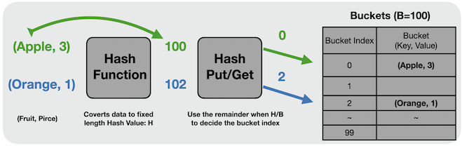
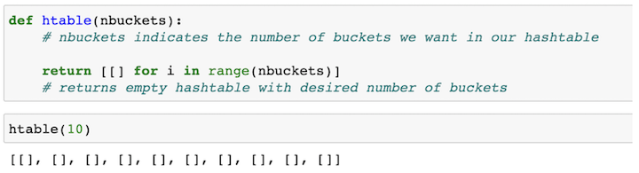

# comm_final_project

The aim of this project is to introduce the topic of hash tables to students in a data science master's program. The repo includes presentation slides going over the conceptual overview of how hash tables work, code implementation on how to build, insert, and pull from a hash table, and runtime comparisons between hash table search and linear search. It also includes a jupyter notebook with all the code used in the presentation.

This is a Final Project in the Communications for Analytics class at the University of San Francisco.

# Conceptual Overview: 

Hash tables are a type of data structure primarily used to efficiently implement key value lookup operations. They are especially good at doing this because they partition the search space into well-defined regions, meaning we can significantly reduce the amount of data we need to search through if we know which region our value is in. Structurally, a hash table is an array like object that contains a set number of buckets in which values are stored strategically according to a hash function. The hash function takes in a key, which is usually a string but can be any kind of data type, as an input to compute the hash code. The hash code is an integer which, ideally, is specific to this key. We can then take the hash code modulo the number of buckets to find the index number where the value is stored, with the index telling us which bucket the data we’re looking for will be stored in. 

# Code Implementation: 

# Hash Table Construction:

We start by building an empty hash table with n numbers of buckets by creating a list of n lists:

# Hash Function:

We wrote a hash function to calculate the hash code of a given key. 

 -> If the key is an integer: the hash code is set to that integer. 
 
 -> If the key is a string: we use the Unicode values of characters in the below calculation to compute the hash code.
 
 -> If the key is neither a string nor an integer it is set to None.
 
 

# Inserting Into a Hash Table: 

We start by looking for the index of the bucket where the key value pair will be stored. We find this index by computing the hash code of the key modulo the number of buckets. We then check if this key already exists in this bucket. If so, we overwrite it, if not we add the new key value pair. 

# Searching Hash Tables:

We start by finding the index of the bucket where the key value pair should be stored with the same method as the insert function. We then check if this key this key is present in this bucket. If it is, we return the value associated to it. If it isn't, we return None. 

# Speed Comparison Between Linear and Hash Table Search:

We ran speed tests to compare how quickly we could find a value within a dataset of 5000 random integers using a linear search method and our hash table implementation. We found that on average, our hash table retrieves data hundreds of times faster than a linear search does.

# Motivation:

By partitioning the data into buckets, hash tables significantly reduce the amount of time it takes to find a particular value. With a uniform distribution of N values among B buckets, we would expect a complexity of N/B. If we then have a very large number of buckets where N/B approaches 1, we would have complexity O(1) compared to complexity O(n) for a linear lookup. 

While hash tables require a higher level of complexity to build, they make lookups significantly more efficient, saving us a lot of time for very large datasets. For this reason, hash tables are very widely used and many conceptual data structures like dictionaries or sets are typically implemented using a hash table.

